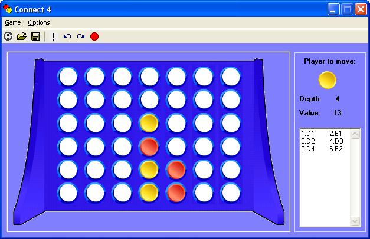



## A Connect 4 game with AI

### Description

This is a classis 4 in a row game with AI. There are 5 standard levels of computer intelligence and the highest level is really hard (if you want to play at that level run the game in the .exe version). There is also a search win/loss mode and the ability to customize the AI level. It can also save/load games and undo/redo moves.
 
### More Info
 

             |
---                |---
**Submitted On**   |2005-10-21 13:57:32
**By**             |[sohaib farsakh](https://github.com/Planet-Source-Code/PSCIndex/blob/master/ByAuthor/sohaib-farsakh.md)
**Level**          |Intermediate
**User Rating**    |5.0 (50 globes from 10 users)
**Compatibility**  |VB 6\.0
**Category**       |[Games](https://github.com/Planet-Source-Code/PSCIndex/blob/master/ByCategory/games__1-38.md)
**World**          |[Visual Basic](https://github.com/Planet-Source-Code/PSCIndex/blob/master/ByWorld/visual-basic.md)
**Archive File**   |[A\_Connect\_2019789142006\.zip](https://github.com/Planet-Source-Code/sohaib-farsakh-a-connect-4-game-with-ai__1-66558/archive/master.zip)

